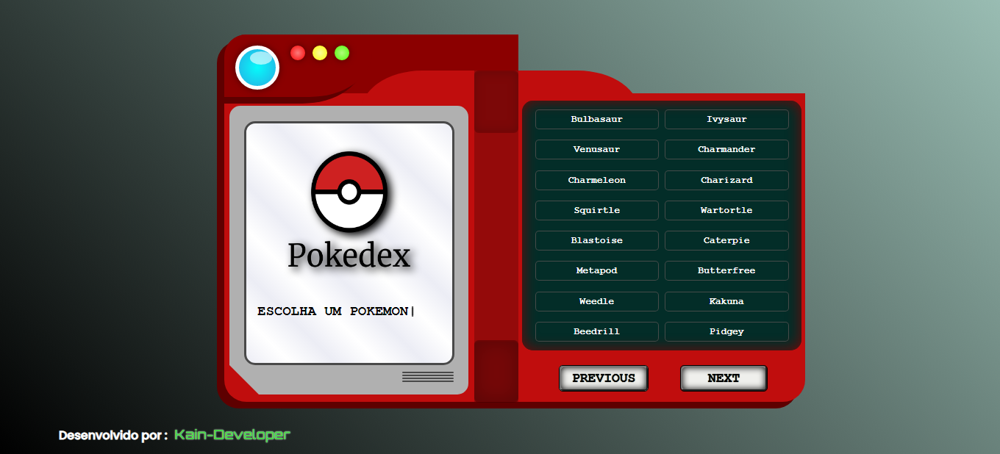
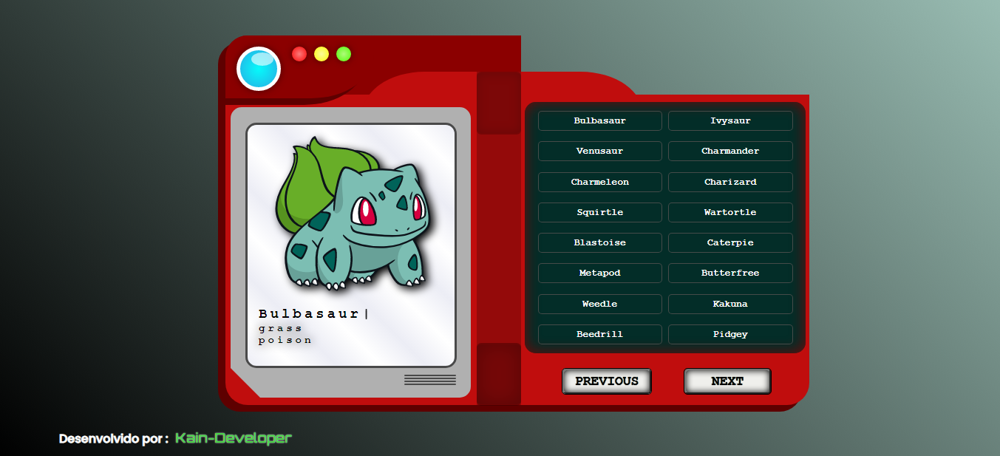
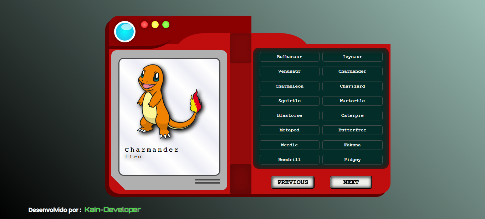
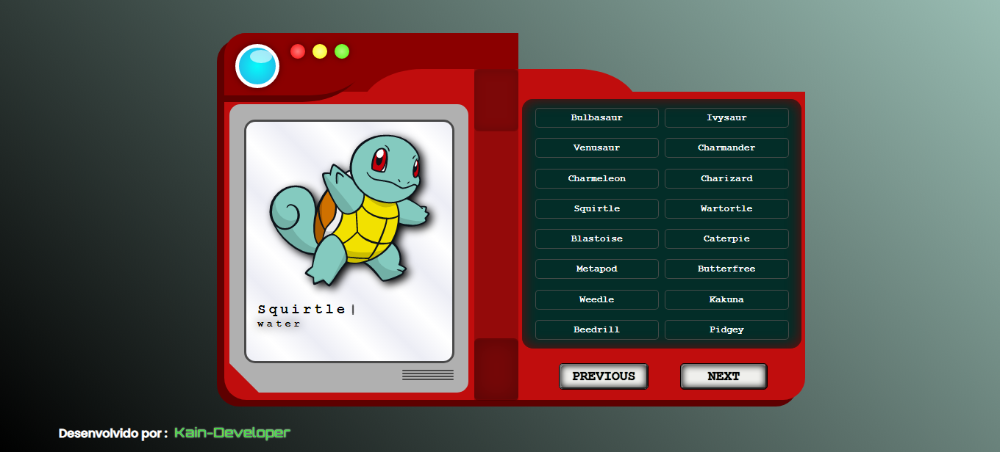

 Pokedéx Site 
https://kain-prog.github.io/pokedex-site/

> Resultado do Projeto finalizado.

O projeto foi criado em:

- [x] ReactJs
- [x] TypeScript
- [x] Axios

Resultado: https://kain-prog.github.io/pokedex-site/

## 🤝 Colaboradores

Pessoa que contribuiu para este projeto:

<table>
  <tr>
    <td align="center">
         
        
          <b>Matheus Santos</b>
        
      </a>
    </td>
   </tr>
</table>
